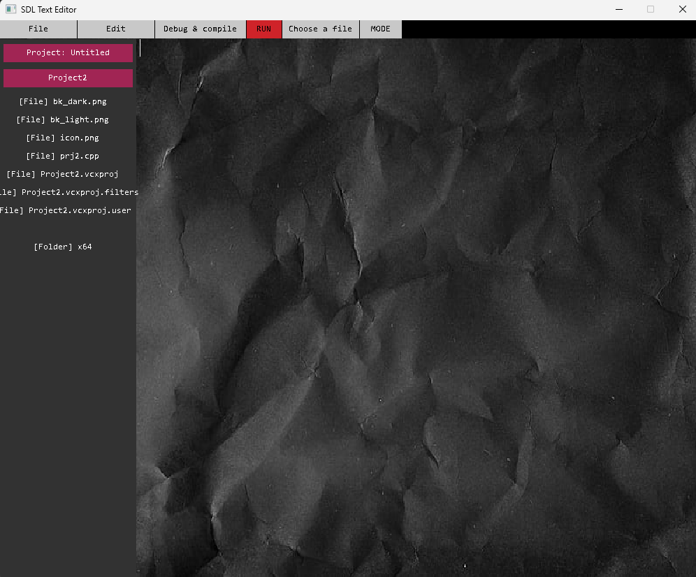

# C++ Text Editor With SDL2
A basic text editor built from scratch using C++ and SDL2, designed specifically for C++ development with advanced syntax highlighting, file management, and integrated development features.  

  
  

## 🚀 Features
-**Real-time Color Coding For C++ Syntax:** including keywords, comments, strings, numbers, and operators  
-**File System Integration:** Complete file browser with tree view navigation  
-**Unlimited Undo/Redo**  
-**Copy/Paste/Cut Support With Text Selection**  
-**Dark And Light Mode**  
-**Built-in Debugger For Parentheses Matching, Bracket Validation, And Semicolon Checking**  
-**Auto-completion:** Intelligent bracket and parenthesis completion  
-**Project Management:** Complete project save/load functionality  

## 🛠️ Built With
[C++](https://isocpp.org/)  
[SDL2:](https://www.libsdl.org/) Cross-platform graphics and window management  
[SDL2_ttf:](https://github.com/libsdl-org/SDL_ttf) TrueType font rendering  
[SDL2_image:](https://github.com/libsdl-org/SDL_image) PNG image loading  
[C++ Standard Regex:](https://en.cppreference.com/w/cpp/regex) Advanced syntax highlighting patterns  
[Windows API:](https://docs.microsoft.com/en-us/windows/win32/api/) Native file dialogs (IFileDialog)  
[STL Containers:](https://en.cppreference.com/w/cpp/container) Vectors, maps, strings for data management

## ⌨️ Keyboard Shortcuts
| Shortcut | Action |	Description |
| --- | --- | --- |
| Ctrl+S	| Save |	Save current file |
| Ctrl+Z	| Undo	| Reverse last action |
| Ctrl+Y	| Redo	| Restore undone action |
| Ctrl+G |	Go to Line |	Jump to specific line number |
| Ctrl+A	| Select All	| Select entire document |
| Ctrl+C	| Copy	| Copy selected text |
| Ctrl+V	| Paste	| Paste from clipboard |
| Ctrl+X	| Cut	| Cut selected text |
| Tab	| Indent |	Insert 4 spaces |

